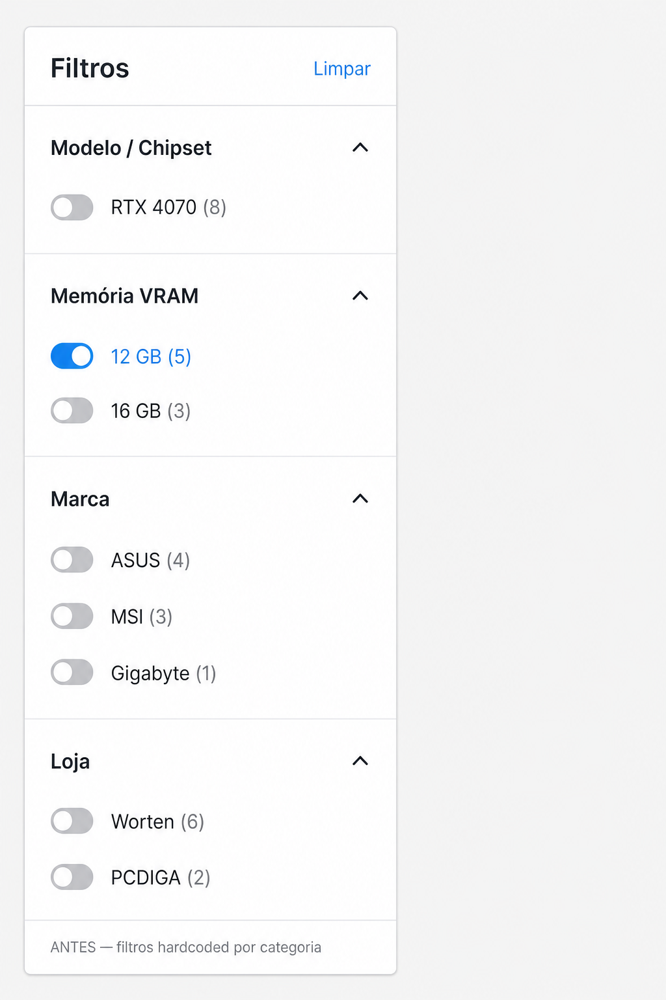
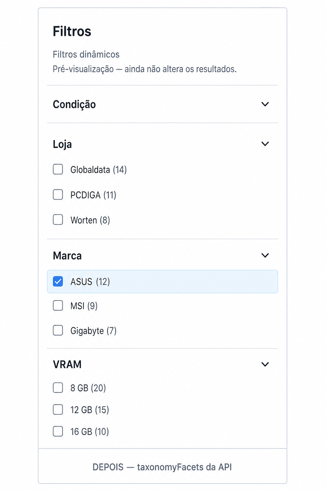

# FASE 7.3 — Frontend Dynamic Taxonomy Filters

**Apenas UI. Pesquisa, backend, API, ranking e classificação inalterados.**

## Objetivo

Construir o painel de filtros a partir de `taxonomyFacets` da resposta de `GET /api/v1/search`.  
Selecção é **local** (pré-visualização) — **não** aplica filtros ao backend nem altera a URL (preparado para FASE 7.4).

## Screenshots

### Antes — filtros hardcoded por categoria (GPU/CPU/…)



### Depois — facets dinâmicos da API (`taxonomyFacets`)



## Arquitetura

```text
GET /api/v1/search
  → SearchResponse.taxonomyFacets?   (opcional)
  → SearchPageClient
       ├─ setTaxonomyFacets(...)
       ├─ taxonomySelection (useState)  ← UI only
       └─ FilterSidebar
            ├─ se hasTaxonomyFacets → TaxonomyFilters → TaxonomyFacetPanel[]
            └─ senão → LegacyCategoryFacets (comportamento actual)
```

| Tipo API | UI |
| --- | --- |
| `enum` | checkboxes + contagem |
| `number` | checkboxes (ordem numérica) |
| `boolean` | switch |
| `range` | placeholder visual + valores |

### Deep-link (preparado, não activo)

`src/lib/taxonomy-facets.ts`:

- `selectionToSearchParams` → `?brand=asus&vram_gb=16&store=worten`
- `selectionFromSearchParams`

**FASE 7.3 não chama estes helpers para mutar a URL.**

## Ficheiros

| Ficheiro | Mudança |
| --- | --- |
| `src/lib/api.ts` | Tipos `TaxonomyFacet` / `TaxonomyFacetValue`; `SearchResponse.taxonomyFacets?` |
| `src/lib/taxonomy-facets.ts` | **Novo** — prepare/sort/selection/deep-link/localStorage expand |
| `src/components/search/TaxonomyFacetPanel.tsx` | **Novo** — render por tipo (`memo`) |
| `src/components/search/TaxonomyFilters.tsx` | **Novo** — lista de facets |
| `src/components/search/FilterSidebar.tsx` | Dual path: taxonomy vs legado |
| `src/components/search/SearchPageClient.tsx` | Consome `taxonomyFacets`; estado local de selecção |
| `src/components/search/__tests__/taxonomy-filters.test.tsx` | **Novo** |
| `vitest.config.ts` | **Novo** |
| `package.json` | scripts `test` / `test:watch` + deps de teste |
| `docs/fase73/*` | Screenshots |
| `taxonomy-fase73-frontend.md` | Este relatório |

**Não alterados:** hub/backend Search, SQL, ranking, resolver, classificador, Telegram, Scheduler, API contracts, `searchProducts()` params.

## Comportamento

- `taxonomyFacets` ausente / `[]` → UI legado **exacta** (sem erro)
- Facets vazias ocultas; ordenação alfabética dos facets; valores por frequência (number: numérico)
- Colapsáveis; expand memorizado em `localStorage` (`limiar.taxonomyFacet.expanded.*`)
- Contadores `(N)` + badge de selecção
- Hint: “Pré-visualização — ainda não altera os resultados.”

## Testes

```text
npm test  →  13 passed
```

Cobertura:

| Caso | ✓ |
| --- | --- |
| Render enum / number / boolean / range | ✓ |
| Sem taxonomyFacets (legado) | ✓ |
| Facets vazias / prepare | ✓ |
| Contadores + selecção | ✓ |
| Memo/helpers + deep-link prep | ✓ |
| Snapshot painel | ✓ |

## Confirmação explícita

| Requisito | Estado |
| --- | --- |
| ✓ pesquisa inalterada | sim — mesmos params a `searchProducts` |
| ✓ backend inalterado | sim |
| ✓ API inalterada | sim — só consumo de campo opcional |
| ✓ Telegram inalterado | sim |
| ✓ Scheduler inalterado | sim |
| ✓ apenas UI dinâmica | sim |
| ✓ preparado para FASE 7.4 (filtros reais) | sim — selection + deep-link helpers |
